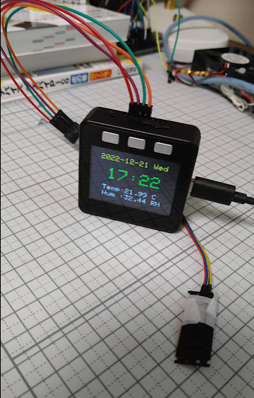

# 

## 概要 (Overview)

M5stackで高精度環境センサ(AHT25)を使い温度・湿度を観測しLog記録します。

## 画面イメージ (ScreenShot)

## 動作要件 (Requirements)

M5stack (Basic) / C++ / PlatformIO / AHT25(Environment sensor) / Wi-Fi /Micro SD card

## 回路図 (Circuit diagram)

|M5stack|AHT25|
|---|---|
|3.3V|VCC|
|SDA|SDA|
|GND|GND|
|SCL|SCL|

※See also AHT25 datasheet

## ライセンス (License)

This software is released under the MIT License, see LICENSE.